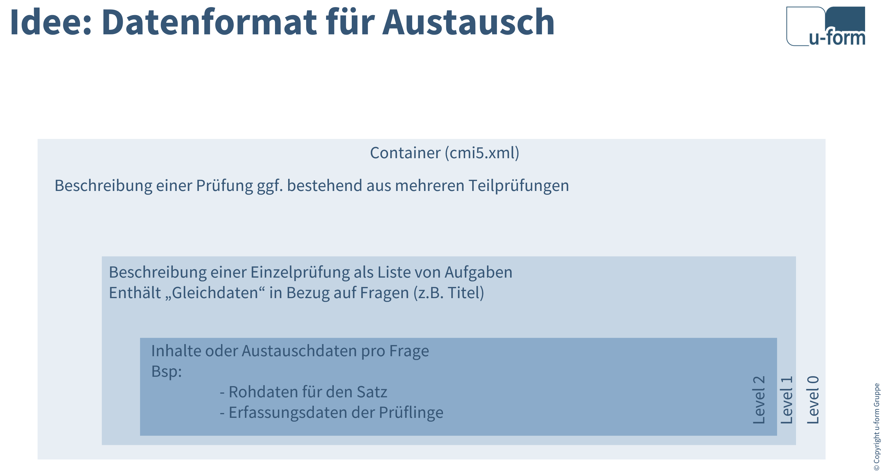

# IHK Content Provider API

API und SPI-Definition für den Prüfungsmanager - einer Management-Shell für IHK Zwischen- und Abschlussprüfungen

## Was ist der Prüfungsmanager

Der u-form Prüfungsmanager ist eine Managementplattform für die Durchführung von Prüfungen. Der Schwerpunkt liegt in der Durchführung von digitalen Zwischen- und Abschlussprüfungen der IHK-Organisationen.

Die Plattform besteht aus einem Managementanteil, die das Handling von Teilnehmenden und Teilnahmen managt. Eine Teilnahmen bedeutet: Die Teilnahme einer Person an einer Prüfung zu einem Zeitpunkt für ein Prüfungsfach.

Die zu prüfenden Inhalte stellen "content provider" (Inhaltsanbieter) zur Verfügung. Um die Inhalte zum richtigen Zeitpunkt mit Teilnahmen zu verbunden, den Ablauf der Prüfung zu steuern und zu überwachen sowie nach Abschluss der Prüfung die Ergebnisse zur Auswertung an die [IHK-GfI GmbH](https://www.ihk-gfi.de/) zu übermitteln, implementieren die Inhaltsanbieter eine Serviceschnittstelle (SPI). Die Registrierung eines Inhaltsanbieters erfolgt wiederum über eine API im Prüfungsmanager.

Kurz dargestellt:

- **API:** Registrierung und Überarbeitung von Inhaltsanbieterdaten (insbesondere Aufruflinks)
- **SPI:** Durch den Inhaltsanbieter zur realisierende Funktionalitäten

Beide Schnittstellen sind in diesem Repository als OpenAPI 3.0.x-Definition beschrieben.

## Konzept des SPI

Die Grundfunktionen des SPI sind im Wesentlichen:

- Auflistung der freigegebenen Inhalte
- Erzeugung von Zugangsdaten für Teilnahmen (One Time Password, TAN)
- Reaktion auf Statusänderungen durch die Managementshell (Angelegt, Freigegeben, Gesperrt,...)
- Subscribe/Unsubscribe von Monitoringdaten während der Prüfung (der Inhaltsanbieter liefert während einer Subscription Statusänderungen an die Shell)
- Abruf von Eingabeedaten nach Beendigung der Durchführung zur Weitergabe an die GfI

Alle Aufrufe erfolgen durch den Prüfungsmanager an den/die Inhaltsanbieter. Ausnahme ist hier eine laufende Subscription. In diesem Fall werden die Daten über SSE oder Websockets an den Prüfungsmanager gesendet.

## Inhaltsanbieter (content provider)

Inhaltsanbieter sind für die Bereitstellung der Prüfungsinhalte verantwortlich. Sie implementieren die SPI, um mit dem Prüfungsmanager zu kommunizieren und die erforderlichen Funktionen bereitzustellen.

## Konzept des Datenaustauschmodells

Das Datenaustauschmodell beschreibt die Struktur der Daten, die zwischen dem Prüfungsmanager und den Inhaltsanbietern sowie integrierten Systemen ausgetauscht werden.

Das Datenmodel ist in mehrere Level unterteilt, die jeweils unterschiedliche Aspekte der Prüfungsinhalte und -strukturen abbilden. Die Level sind:

- **Level 0:** Basisinformationen zu Prüfungen inkl. Metadaten. Basierend auf dem Standard xAPI 2.0 und CMI5.
- **Level 1:** Grundlegende Struktur der Prüfungsfragen. Insbesondere eine Liste der Prüfungsfragen.
- **Level 2:** Detaillierte Informationen zu Prüfungsfragen und -antworten. Diese Inhalte sind von Anwendungsfall und den Kommunikationspartnern abhängig.



Die Definitionen sind in XSD (XML Schema Definition) und OpenAPI 3.0.x-Format verfügbar.

## Technische Schnittstellendefinitionen

Die technischen Definitionen beschreiben die Schnittstellen im OpenAPI-Format V3

[Technische Definition der API](api.html)

[Technische Definition der SPI](spi.html)

## CMI5 Beispielstruktur für Medienkaufleute Digital und Print

Nachfolgend ein Beispiel für eine CMI5-konforme XML-Struktur mit einer Assignable Unit (AU) für "Medienkaufleute Digital und Print":

```xml
<?xml version="1.0" encoding="UTF-8"?>
<courseStructure xmlns="https://w3id.org/xapi/profiles/cmi5/v1/CourseStructure.xsd"
                xmlns:ihk="https://apidocs.pruefung.io/xsd/ihk-level1.xsd"
                xmlns:ihkrecords="https://apidocs.pruefung.io/xsd/ihk-level2-executionrecords.xsd"
                xmlns:xsi="http://www.w3.org/2001/XMLSchema-instance"
                xsi:schemaLocation="https://w3id.org/xapi/profiles/cmi5/v1/CourseStructure.xsd cmi5.xsd">
    <course id="https://example.pruefung.io/courses/medienkaufleute-2025">
        <title>
            <langstring lang="de">ZP F25 Medienkaufleute Digital und Print</langstring>
        </title>
        <description>
            <langstring lang="de">IHK-Zwischenprüfung Frühjahr 2025 für Medienkaufleute Digital und Print</langstring>
        </description>
    </course>
    <au id="https://example.pruefung.io/au/medienkaufleute-2025" moveOn="CompletedAndPassed" masteryScore="0.7"
        launchMethod="OwnWindow" activityType="assessment">
        <title>
            <langstring lang="de">ZP F25 Medienkaufleute Digital und Print</langstring>
        </title>
        <description>
            <langstring lang="de">IHK Zwischenprüfung Frühjahr 2025 für Medienkaufleute Digital und Print</langstring>
        </description>
        <objectives>
            <objective idref="https://example.pruefung.io/objectives/medienkaufleute-2025/1"></objective>
            <!-- Level 1: Definition der Prüfungsfragen -->
            <ihk:questionList berufenummer="5598" pruefungszeitpunkt="F25">
                <ihk:question>
                    <ihk:id>1</ihk:id>
                    <ihk:title>Was ist der Hauptzweck des Marketings?</ihk:title>
                    <ihk:interactiontypes>fill-in</ihk:interactiontypes>

                    <!-- Level 2: Austausch von Erfassungen vom Prüfungsmanager zur GfI -->
                    <ihkrecords:answerlist>
                        <ihkrecords:questionid>1</ihkrecords:questionid>
                        <ihkrecords:participantid>12345</ihkrecords:participantid>
                        <ihkrecords:participationid>67890</ihkrecords:participationid>
                        <ihkrecords:gfinummer>1234567890</ihkrecords:gfinummer>
                        <ihkrecords:answer>
                            <ihkrecords:id>2</ihkrecords:id>
                            <ihkrecords:title>Kundenbindung stärken</ihkrecords:title>
                            <ihkrecords:interactiontype>fill-in</ihkrecords:interactiontype>
                            <ihkrecords:answertext>Test</ihkrecords:answertext>
                        </ihkrecords:answer>
                    </ihkrecords:answerlist>
                </ihk:question>
            </ihk:questionList>
        </objectives>
        <url>https://example.pruefung.io/launch/medienkaufleute-2025</url>
    </au>

</courseStructure>
```

Diese XML-Struktur enthält:

- Eine Course-Definition mit Titel und Beschreibung
- Eine AU (Assignable Unit) für "Medienkaufleute Digital und Print" mit:
  - Berufekennnummer "82122" als zusätzliches Attribut
  - Prüfungszeitpunkt "2025-06-05T09:00:00+02:00" als zusätzliches Attribut
  - Verschiedene CMI5-konforme Attribute wie moveOn, masteryScore und launchMethod
  - Titel, Beschreibung und Launch-URL
